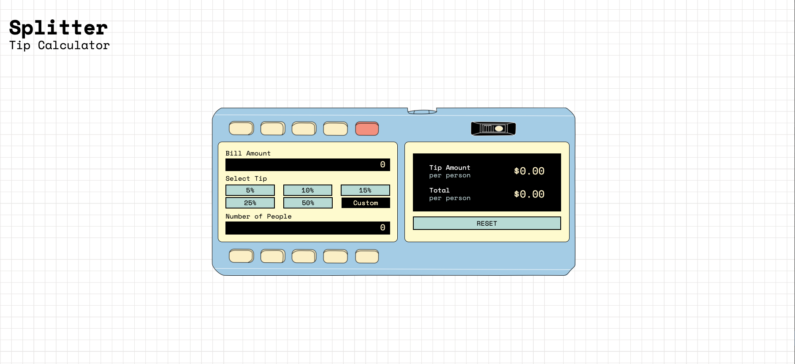

# Frontend Mentor - Tip calculator app solution

This is a solution to the [Tip calculator app challenge on Frontend Mentor](https://www.frontendmentor.io/challenges/tip-calculator-app-ugJNGbJUX).

### The challenge

Users should be able to:

- View the optimal layout for the app depending on their device's screen size
- See hover states for all interactive elements on the page
- Calculate the correct tip and total cost of the bill per person

### Screenshot

## My process

I started with the challenge as suggested by frontendmentor then redesigned it visually based on the Casio Personal Mini calculator, released around 1975.
I also added some enhancements for accessibility, including adjusting the colour contrast ratio and adding aria-live attributes so that the dynamic changes are announced to screen reader users.

### Built with

- Semantic HTML5 markup
- CSS custom properties
- Vanilla Javascript
- ARIA
